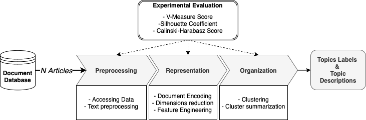
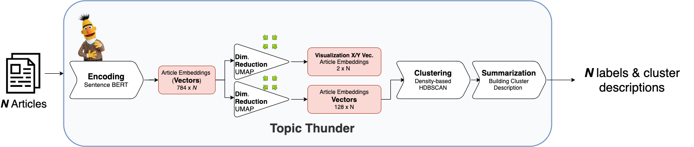

# SentenceBERT for Topic modeling
Embedding-based topic modeling system for news articles

## Idea


This repository stores the code and documentation for the Master Thesis project - "Design and evaluation of embedding-based topic modeling system for news articles".
The goal of the project was to design as fast and scalable topic tracking and detection system.  The system should be able to dynamcally create a new analytica dimensions for news articles - topics. 


Presentation explaining the project: \
[](https://www.youtube.com/watch?v=StTqXEQ2l-Y "Talk")

### Thesis abstract
Topic modeling analyzes documents to learn meaningful patterns and extract the hidden semantic structure in a collection of documents. Unfortunately, classical topic models do not scale easily and often fail when working with massive corpora and vocabularies. Furthermore, most of the algorithms are suited for static analysis and require frequent and expensive retraining to cover up-to-date events. 
This master's thesis aims to address the above-mentioned limitations and develop an unsupervised approach to on-line topic modeling and detection based on document clustering. The main contribution of this work is a framework for continuous labeling of incoming news articles with new topics as they arise.
The introduced method measures the similarities between news articles utilizing a pretrained Siamese BERT network that derive semantically meaningful document embeddings. These embeddings after post-processing form the input to the clustering algorithm which groups similar articles together and summarizes the clusters using keyword extraction algorithm. The proposed method can be used to model topics in both static (fixed set of articles) and incremental settings. 
While it is apparent that the proposed method can scale well for millions of articles, it is required to perform a comprehensive evaluation to confirm that this solution can work well on both benchmark and real-world datasets.   Therefore, in order to validate the approach the author aims to use benchmark datasets of news articles in German language. Furthermore, the framework is to be tested in a real-life scenario on a growing set of articles from a well-known German news portal - `BILD.de`.
The scope of the evaluation is to demonstrate that the proposed system achieves high performance in terms of both accuracy of topic labeling  and topic interpretability compared to the classical topic modeling algorithms.  Finally, it will be assessed if the proposed method can effectively assign an interpretive topic label in a human-understandable way. 

## Design




## Colab Examples

## Data
In the `data` directory you can find scripts and datasets used while working on that project. 
- headlines-2016-deepl.csv - set of ca. 750 headline pairs from the SentEval dataset. Translated using DeepL. Can be used for fine-tuneing. [Original File](https://github.com/brmson/dataset-sts/blob/master/data/sts/semeval-sts/2016/headlines.test.tsv). Good for further fine-tuning of the SBERT model.
- omp-articles-full.csv - a complete list of all the articles from the OMP dataset. It is combined with the count of comments using this query :
```sql 

select Articles.ID_Article as ID_Article, Path, publishingDate, Title, Body, comments
from Articles
         left join (select ID_Article, count(*) as comments
                    from Posts
                    where Status != 'deleted'
                    group by ID_Article) as arts on Articles.ID_Article = arts.ID_Article

```
- omp-bert-results.csv - contains final results of the analysis.
- labeled_test_clusters.csv	- contains 500 labeled articles (20 Clusters). Used for parameter search and evaluation of the clustering performance.
FIY. Articles data was collected using RSS Feed and simple scraping scripts inspired by [BildMining](https://github.com/Frank86ger/BildMining)
## Notebooks
Notebook directory contains multiple notebooks with experiments and presentations of the results.
- BertTopic_Presentation.ipynb -  


## Prefect
In the prefect directory you will find the production-ready implementation of the pipeline using Prefect. You will need to set up a database(Docker), and load your first batch of articles. 

Follow the instructions in the Readme inside.

## Analitical dashboard
In the `dash` folder you can see an inmplementation of a dashboard presetning the results of topic modeling combined with performance data.

  ```bash
  $ pip install -r requirements.txt
  $ pip install hdbscan umap-learn mlflow dash --upgrade
  $ python ./dash/app.py  
  ```

## Resources:
#### Articles:
- Papers with code: Sentence Emebddings - https://paperswithcode.com/task/sentence-embeddings

- SentenceBERT TLDR - https://medium.com/dair-ai/tl-dr-sentencebert-8dec326daf4e 
- BERTopics - https://towardsdatascience.com/topic-modeling-with-bert-779f7db187e6
- Comprehesive overview of documents embeding techniques with lots of references and comparisons:  https://towardsdatascience.com/document-embedding-techniques-fed3e7a6a25d
- https://supernlp.github.io/2018/11/26/sentreps/
- http://mlexplained.com/2019/01/07/paper-dissected-bert-pre-training-of-deep-bidirectional-transformers-for-language-understanding-explained/
- Explanation of the SBERT: https://medium.com/genei-technology/richer-sentence-embeddings-using-sentence-bert-part-i-ce1d9e0b1343
- MLFLOW Setup :https://github.com/ymym3412/mlflow-docker-compose#3-Set-up-NGINX-Basic-Authentication


- Boosting the quality of embedding by simple prepossessing : https://github.com/vyraun/Half-Size

- Plotly and dash for NLP viz: https://medium.com/plotly/nlp-visualisations-for-clear-immediate-insights-into-text-data-and-outputs-9ebfab168d5b

- FAISS from Facebook AI - A library for efficient similarity search and clustering of dense vectors. - https://github.com/facebookresearch/faiss

#### Papers:
- PV for Vox Media + Wikipedia: 
- https://www.catalyzex.com/paper/arxiv:1208.4411
- https://www.sciencedirect.com/science/article/pii/S1532046416300442
- https://reader.elsevier.com/reader/sd/pii/S1532046416300442
- Effective Dimensionality reduction for word embeddings - https://www.aclweb.org/anthology/W19-4328/
- Text Summarization with pretrained encoders (can be used fror cluster description) - https://arxiv.org/abs/1908.08345 
